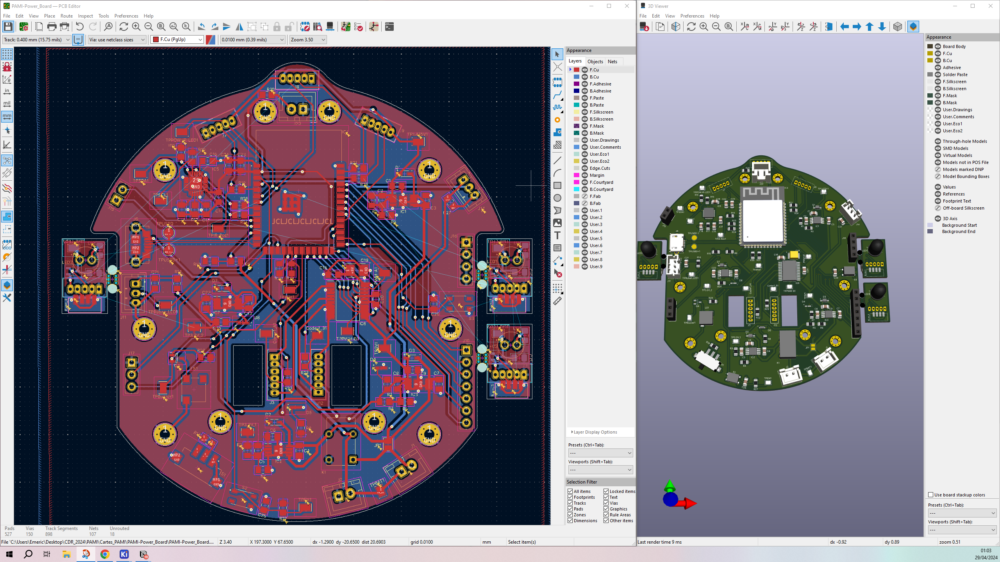
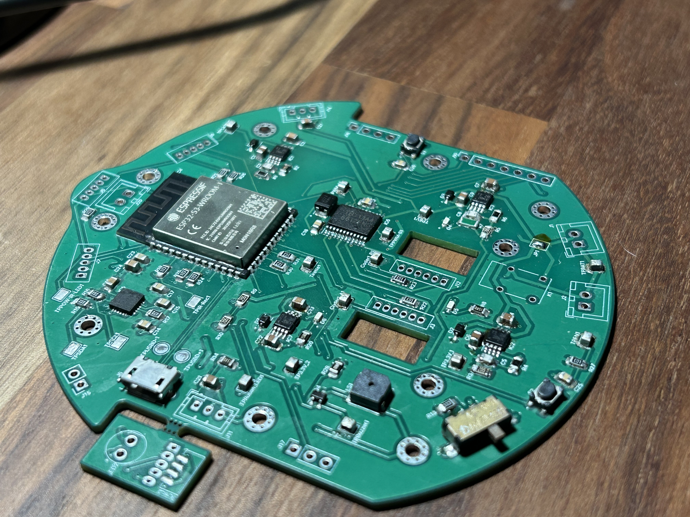

# PAMI Power Board (KiCad)

Power/IO board for a Small MicroROS-based robot project. Contains KiCad schematics/PCB, custom symbols/footprints, and fabrication outputs (Gerbers + drills).

## Contents
- PAMI-Power_Board.kicad_pro / .kicad_sch / .kicad_pcb: main KiCad project
- FAB/: manufacturing files (Gerbers, PTH/NPTH drills, job file)
- Specific_symbols_and_footprints/: custom symbols/footprints + 3D models
- top_level_diagrams/: high-level diagrams

## Board routing stage

## Final board result

## Fabrication
Upload the files in FAB/ (Gerbers + drills) to your PCB manufacturer.
